# 💰 PROPAY - Employee Payroll Management System

PROPAY is a full-stack payroll and HR management solution tailored for businesses.
It provides a dark-themed UI, AI-powered HR assistant, and comprehensive payroll automation with enterprise-grade security.

## 🌟 Features
### - Core Payroll Management
-   Employee Management  : Complete employee lifecycle management with detailed profiles
-   Salary Management  : Flexible salary structures with multiple compensation components
-   Payslip Generation  : Automated PDF payslip generation with detailed breakdowns
-   Tax Calculations  : Automated tax deductions and compliance reporting
-   Department Management  : Organize employees by departments with hierarchical structure

### - Advanced Features
-   Attendance Management  : Track employee attendance with integration support
-   Leave Management  : Comprehensive leave tracking and approval workflow
-   Compliance Reporting  : Generate compliance reports for audit and regulatory requirements
-   Analytics Dashboard  : Real-time insights and analytics on payroll data
-   Document Management  : Secure storage and management of payroll-related documents

### - AI-Powered Assistant
-   AI Assistant  : Integrated Google Gemini AI for intelligent payroll queries and assistance
-   Smart Insights  : AI-driven recommendations for payroll optimization
-   Natural Language Processing  : Query payroll data using natural language

### - Security & Authentication
-   JWT Authentication  : Secure token-based authentication system
-   Role-Based Access Control  : Multiple user roles with granular permissions
-   Data Encryption  : Secure handling of sensitive payroll information
-   Session Management  : Robust session handling with automatic timeouts

## 🏗️ Architecture

### - Backend (Spring Boot)
-   Framework  : Spring Boot 3.3.4 with Java 22
-   Database  : MySQL 8.0 with HikariCP connection pooling
-   Security  : Spring Security with JWT authentication
-   API Documentation  : OpenAPI 3.0 with Swagger UI
-   PDF Generation  : iText PDF library for payslip generation
-   AI Integration  : Google Gemini AI for intelligent assistance

### - Frontend (React)
-   Framework  : React 18.2.0 with modern hooks
-   Routing  : React Router DOM for navigation
-   UI Components  : React Bootstrap with custom styling
-   State Management  : Context API for global state
-   HTTP Client  : Axios for API communication
-   Charts  : Chart.js for data visualization
-   Forms  : Formik with Yup validation

### User Profile & System Architecture
<div align="center">
  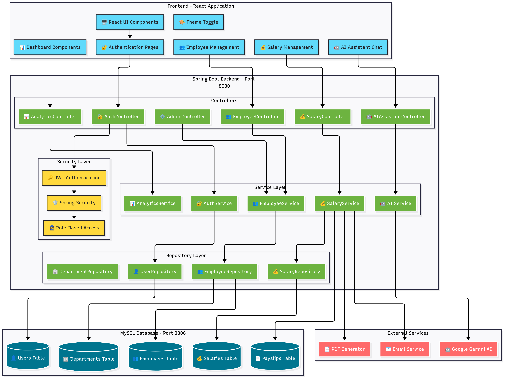
</div>
<hr>
<div align="center">
  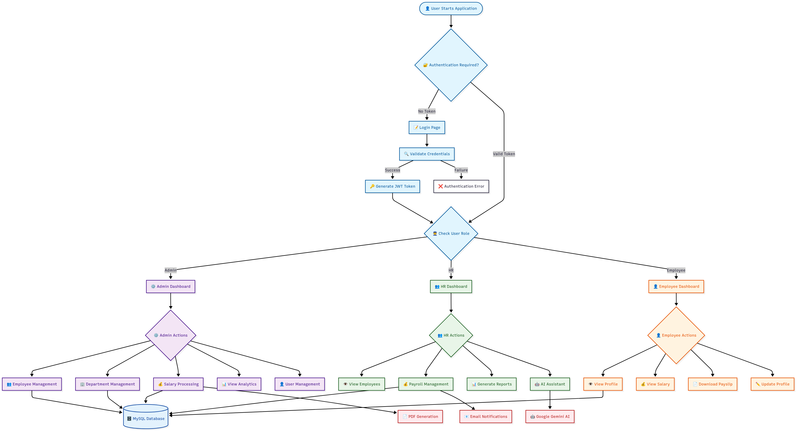
</div>

## 🚀 Quick Start

### Prerequisites
- Java 22 or higher
- Node.js 16+ and npm
- MySQL 8.0
- Maven 3.6+

### Installation

1.   Clone the repository  
   ```bash
   git clone https://github.com/yashp1395/PROPAY.git
   cd PROPAY
   ```

2.   Database Setup  
   ```sql
   CREATE DATABASE payroll_system;
   CREATE USER 'payroll_user'@'localhost' IDENTIFIED BY 'password';
   GRANT ALL PRIVILEGES ON payroll_system.* TO 'payroll_user'@'localhost';
   FLUSH PRIVILEGES;
   ```

3.   Backend Configuration  
   ```bash
   cd backend
   # Update application.properties with your database credentials
   cp src/main/resources/application.properties.example src/main/resources/application.properties
   ```

4.   Environment Variables   (Optional)
   ```bash
   export DB_HOST=localhost
   export DB_PORT=3306
   export DB_NAME=payroll_system
   export DB_USERNAME=payroll_user
   export DB_PASSWORD=password
   export JWT_SECRET=your-jwt-secret-key
   export GEMINI_API_KEY=your-gemini-api-key
   ```

5.   Start the Application  
   ```bash
   # Make the startup script executable
   chmod +x start-PROPAY.sh
   
   # Start both backend and frontend
   ./start-PROPAY.sh
   ```

### Manual Setup

 Backend:  
```bash
cd backend
mvn clean install
mvn spring-boot:run
```

 Frontend:  
```bash
cd frontend
npm install
npm start
```

## 📱 Application Access

-   Frontend  : http://localhost:3000
-   Backend API  : http://localhost:8080/api
-   Swagger UI  : http://localhost:8080/swagger-ui.html
-   API Documentation  : http://localhost:8080/api-docs


## 🎨 Screenshots

### Authentication & Dashboard
<div align="center">
  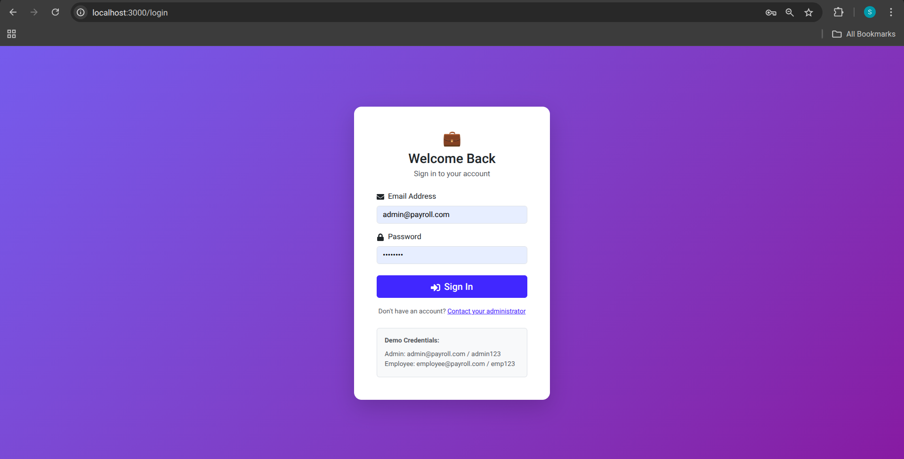
  <br><hr>
  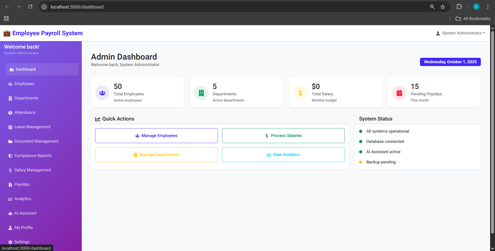
</div>

### Employee & Department Management
<div align="center">
  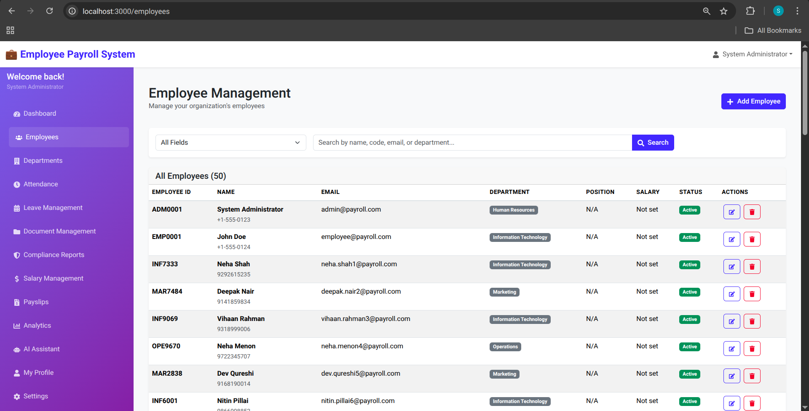
  <br><hr>
  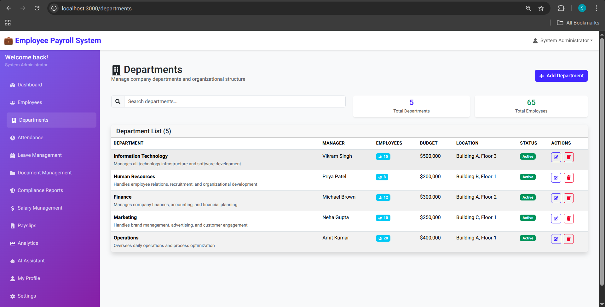
</div>

### Payroll & Salary Management
<div align="center">
  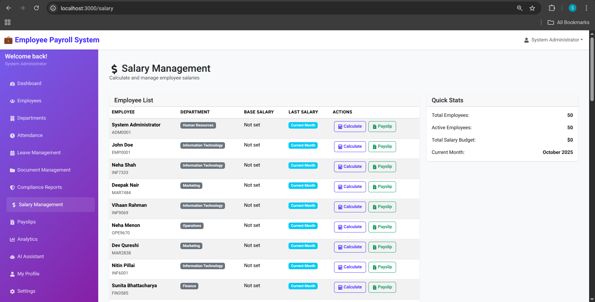
  <br><hr>
  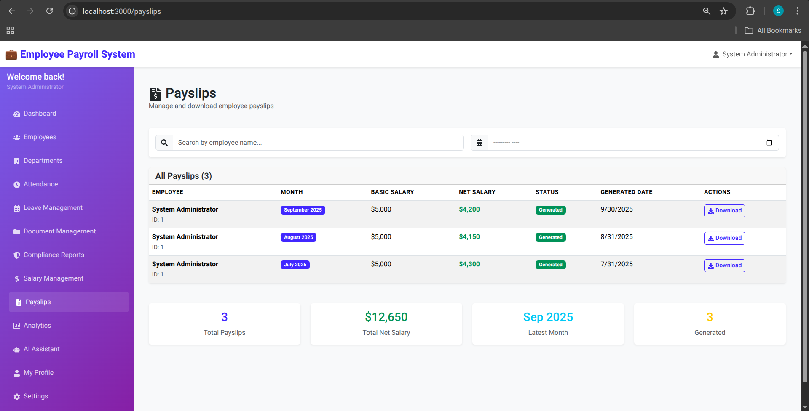
</div>

### Attendance & Leave Management
<div align="center">
  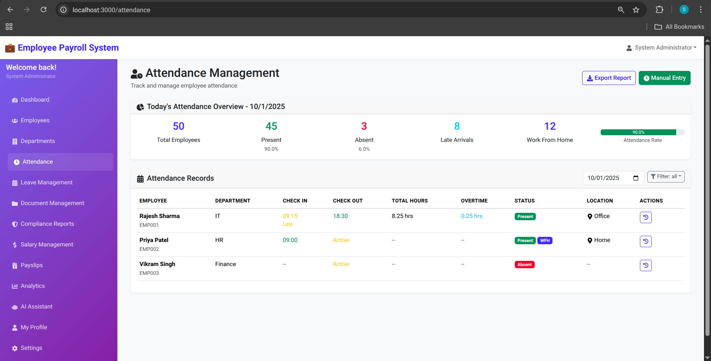
  <br><hr>
  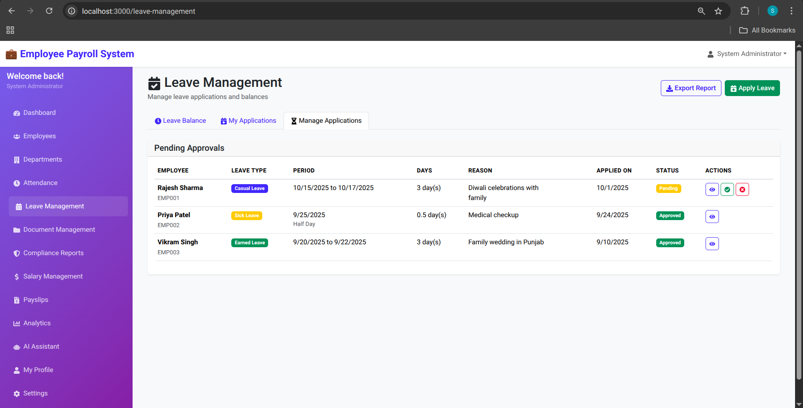
</div>

### Compliance & Settings
<div align="center">
  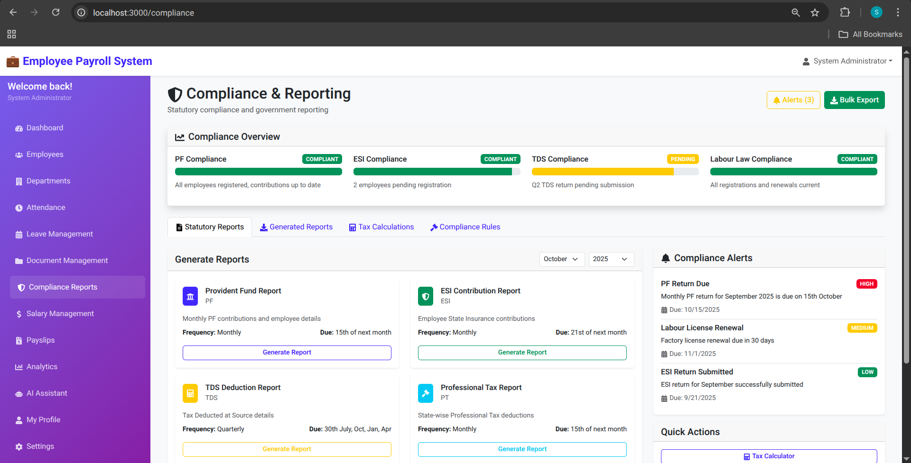
  <br><hr>
  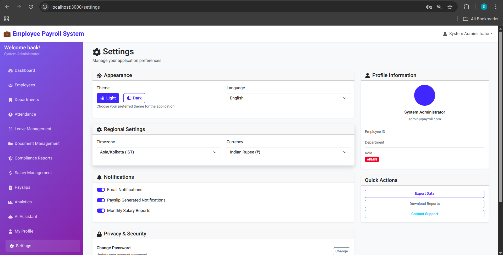
  
</div>

## 👥 Author

-   Developer  : Yash Patil
-   GitHub  : [@yashp1395](https://github.com/yashp1395)

---

